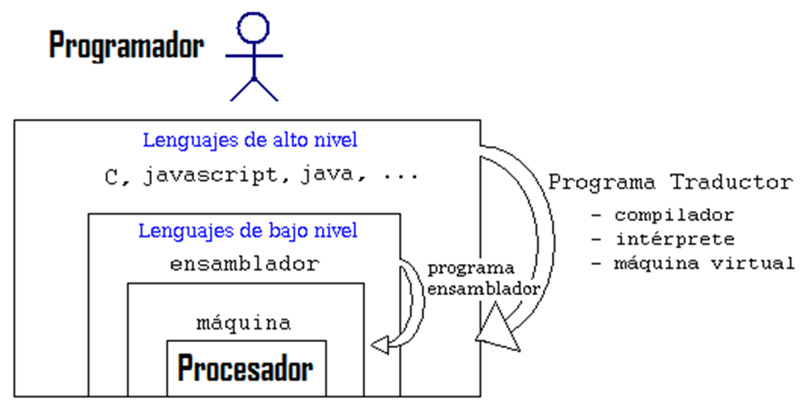

# Compiladores e intérpretes

**Compiladores**: Programas que convierten el código fuente (alto nivel) a lenguaje máquina (bajo nivel)

**Decompiladores**: Se encargan de lo opuesto pero tienen un problema de pérdida de datos importante

Existen **compiladores** e **intérpretes**, que se encargan de traducir el código fuente. Los compiladores lo traducen por completo, mientras que los intérpretes traducen según lectura. Los intérpretes son programas que acompañan al script en la máquina donde se ejecute

Los navegadores tienen intérpretes para visualizar **lenguajes web**

-------- -------- 
- Compiladores:
    - Normalmente más rápidos
    - No siempre son portables
    - Siempre listo para ser ejecutado
    - El código fuente no se comparte

- Intérpretes:
    - Normalmente más lentos
    - Siempre son portables
    - No preparados para ser ejecutados
    - El código fuente se comparte con el usuario

# Intermediación (Just-in-Time)

Existe una **tercera forma** de ejecutar un programa en la que solo se **compila lo esencial** o más comunmente usado por el usuario, mientras que las demás posibilidades de la aplicación se **interpretan**

# Ejemplos de lenguajes

- Lenguajes compilados:
    - C ++, Swift, C, ...

- Lenguajes interpretados:
    - JavaScript, Python, PHP, ...

- Lenguajes híbridos:
    - Java, ActionScript, LISP, ...

Normalmente cuando se busca que que un programa sea **multiplataforma**, se busca un lenguaje interpretado

El **Just-in-Time** es muy eficiente y veloz

Muchos lenguajes traen consigo **Máquinas virtuales**, como MVJ en el caso de Java, que se encargan de interpretar

# Fron-end y Back-End

- **Front-end:** Parte pública de un programa o aplicación (también puede referirse a con lo que interactúa el **usuario final**)

- **Back-end:** Parte privada de un programa o aplicación (también puede referirse al **script**)

- **Full-Stack:** Ambas partes (Se conoce como una especialidad en el área del computing)

# Reglas de la programación

Bases que uno debe conocer a la hora de aprender o utilizar un lenguaje

- **Case sensitive:**
    - El lenguaje diferencia entre minúsculas, mayúsculas, símbolos y espaciado (lo opuesto es **insensitive**)

- **Statements:**
    - Forma en la que se inicia y termina cada **sentencia**

- **Whitespace:** 
    - Espacios y sangrías que hagan del script **legible**, tanto para la máquina, como para el programador o sus compañeros

- **Comments:** 
    - Forma de escribir comentarios aclaratorios o de ordenación que **no sean interpretados** por el ordenador como instrucción

- **Keywords:**
    - Las **palabras reservadas** del lenguaje las cuales no pueden ser reasignadas o utilizadas en otro contexto que no sea para el que están programadas

(**NOTA: La sintaxis no puede ser ambigua**)

# Otros

**COBOL** es un lenguaje muy antiguo de programación en la actualidad usado casi exclusivamente por la banca debido a la gran inversión que se llevó a cabo en este lenguaje y el coste de cambiarlo

**Texto plano** es aquel que no tiene caracteres especiales, fuentes, cursivas, ... Es **monoespaciado** e ideal para programación ya que no contiene información estética que pueda afectar a la compilación

Cada vez que un programa se ejecuta, **se carga en memoria** 
(**_el intérprete va cargando según traduce o vaya necesitando_**

- **Tiempo de compilación:** tiempo que tarda el código fuente en ser traducido a lenguaje máquina

- **Tiempo de ejecución:** tiempo que tarda en empezar a correr el programa

La **calculadora de Windows** trae un modo programador para conversiones entre **decimal, binario, octal y hexadecimal**

La **tabla ASCII** es un convenio de valores mediante los que se representan los caracteres occidentales

Entre las **mayúsculas** y las **minúsculas**, hay una diferencia de 32 en codificación **decimal**

