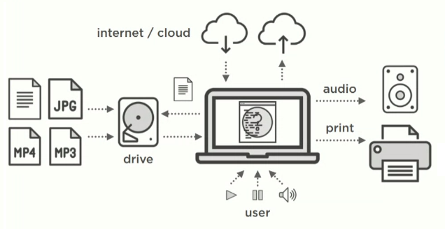
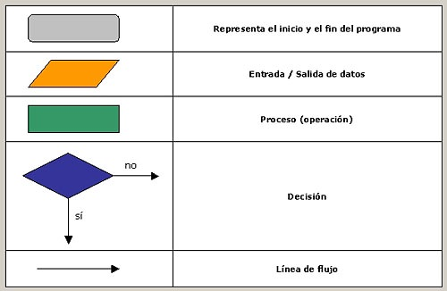
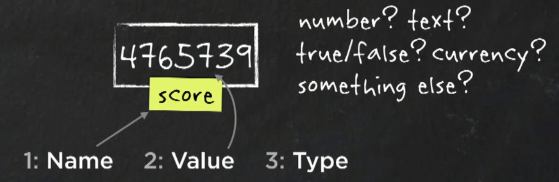

# Entrada/Salida

* Al acceder a los distintos periféricos (disco, nube, altavoces, ...) se habla de **entrada/salida** refiriéndose a la dirección en la que va la información

* Entrada: el dispositivo recibe
* Salida: el dispositivo envía

(**Nota: el usuario se considera entrada y la pantalla del ordenador una salida**)

# Flujo del algoritmo/programa

* Esquema del proceso de ejecución de nuestro algoritmo/programa

* Uno de los pasos más importante en el trabajo de equipo/empresas

# Variables

* Datos con identificadores de un tipo determinado que se utilizan para llevar a cabo nuestro programa

* La asignación, es el nombre con el que se denomina a introducir o cambiar el valor de la variable

* Tienen **_nombre_** (Num1, Nombre, Altura, ...)
* Tienen **_valor_** (15, a, True, ...)
* Dicho valor debe ser de un **_tipo_** (int, char, boolean, ...)

* Las variables deben tener un **_tipo determinado_** para poder comunicarle al pc el espacio en memoria que necesitará para funcionar, tratando de ser lo más preciso posible por eficiencia

* Es una práctica muy recomendada **_inicializar_** las variables
    * Valores int: 0
    * Valores char: ' '

# Reglas para el nombramiento de variables

* Deben tener un nombre **_intuitivo_** (que fácilmente se entienda qué alberga, especialmente para programadores externos)

* Su identificador no puede empezar por un número

* No se recomienda que empiecen por mayúsculas, ya que se reserva a los identificadores de funciones

* No se pueden utilizar espacios en el identificador

* Si el identificador utiliza más de una palabra, la segunda palabra quedaría separada por un guión bajo o empezaría por mayúsculas
(Ej: Nombre_Alumno  o  NombreAlumno)

(**Nota: si creo una variable con mayúsculas en un lenguaje _case sensitive_, durante todo el programa, debo referirme a ella durante todo el programa exactamente con ese nombre**)

# Condiciones

* Una condición es una instrucción que se lleva a cabo si se cumple una igualdad que hemos establecido

* Pueden tener una instrucción aparte para que se cumpla en caso contrario a la igualdad establecida

# Bucles

* El bucle **Mientras** se ejecuta solo si se cumple la igualdad y deja de hacer la instrucción cuando deje de cumplirse

* El bucle **Hacer Mientras** se ejecuta **mínimo** una vez aunque la igualdad no se cumpla

* El bucle **Para** tiene una cantidad de repeticiones especificada al inicio

# Casos

* Existe una estructura **según** similar a las condiciones, en las que se ejecuta una u otra instrucción según la variable que elijamos tome uno u otro valor

# Otros

* La mayoría de compiladores tienen preferencia de operaciones (prioridad de matemáticas, paréntesis, multiplicación/división, suma/resta, ...)