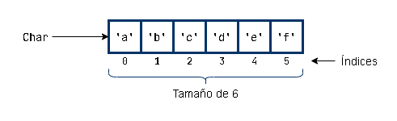

# Bucles

* El bucle **para cada** o **for each**, no necesita de una variable que cuente la cantidad de veces que se ejecuta. Automáticamente, se repite n veces (siendo n la cantidad de elementos) e irá tomando dichos elementos como valores

# Arreglos y Colecciones

* Una matriz o colección (Array o Arreglo) es un tipo de dato que define una estructura contenedora de diferente información o valores referenciados por índices

* Los índices empiezan desde el **cero**


* Para pasar por cada una de las posiciones, necesitamos una iteración con una variable i que pase por cada uno de los índices

# Bibliotecas

* En la programación ordenada, una **biblioteca** se refiere a una colección de archivos, programas, rutinas, script o funciones a las que se puede hacer referencia en el código de programación. Estas bibliotecas son más complejas que las rutinas, optimizadas e incluso pueden ser diseñadas por los mismos programadores detrás del lenguaje de programación

* **Forma nativa** significa sin uso de bibliotecas añadidas

# Script

* Un **script** o lenguaje de secuencias de comandos, es un lenguaje informático con una serie de comandos dentro de un archivo capaz de ejecutarse sin compilarse. Buenos ejemplos de lenguajes de secuencias de comandos del lado del servidor incluyen Perl, PHP y Python. El mejor ejemplo de un lenguaje de secuencias de comandos del lado del cliente es JavaScript

* Como programadores tenemos que tener en cuenta si nuestro programa va a dar respuesta al servidor o al usuario

* Se pueden ejecutar **Scripts** desde el command prompt y debe tener **extensión .cmd**

* Si escribo copy con <NombreArchivo.Extensión> en la consola, esta me creará un archivo exactamente igual en el que se guardará lo que escriba a continuación (finaliza con Ctrl + Z)

(**NOTA: he creado un archivo actualizarGIT.cmd en la carpeta por defecto del prompt que al ejecutarla directamente ejecuta los comandos de cargar la carpeta EOI y añadir al stage las actualizaciones**)

```
C:\Users\Cristina> copy con actualizarGIT.cmd
cd \..
cd 00-EOI
git add .

(Ctrl + Z)

C:\Users\Cristina> actualizarGIT.cmd
C:\00-EOI>
```

# Otros

El **casting** es el proceso en el que el ordenador decide que tipo de dato es un valor

**Fuertemente tipado** significa que cada valor debe ser tipado y su conversión entre distintos tipos de datos es muy específica

**W3C** es el consorcio que decide toda la regulación acerca de la web