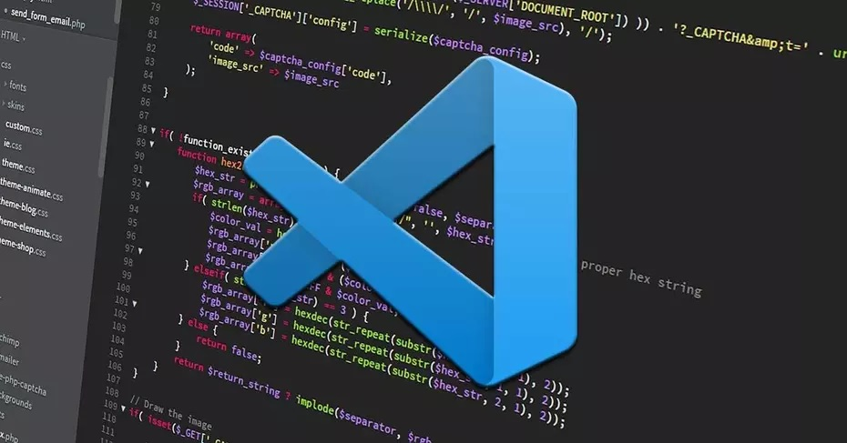
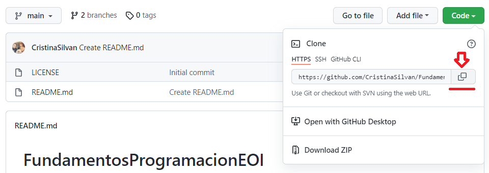
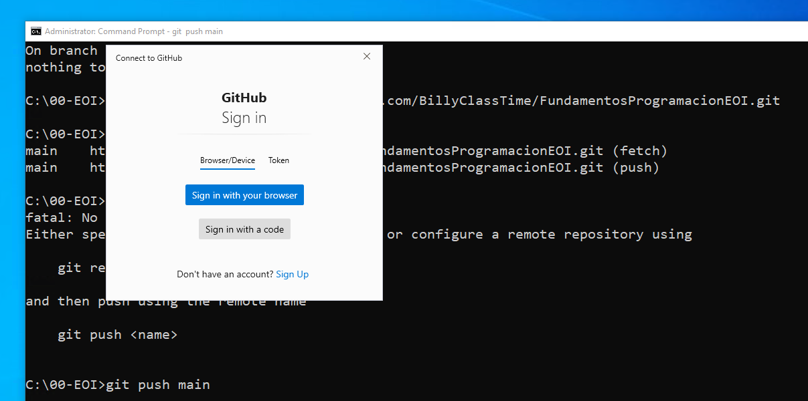
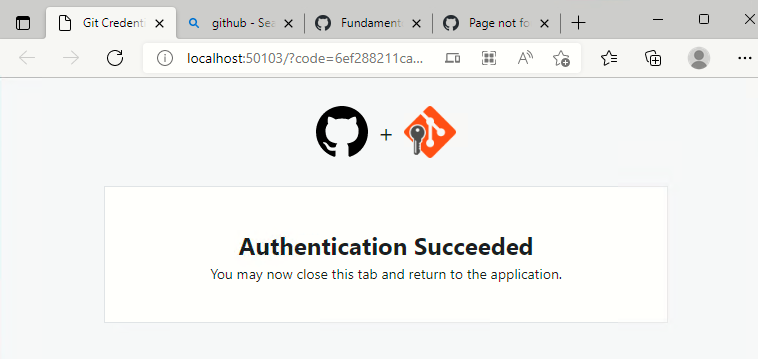

# **Objetivo de la mañana de hoy** (07/04/2022)

## **1. Instalar un editor de Markdown** (**_CONSEGUIDO_**)




## **2. Explorar GitHub** (**_CONSEGUIDO_**)

_GitHub de los compañeros_:


```
Billy
10:08 AM

github.com/BillyClassTime/FundamentosProgramacionEOI

Lina María Vásquez Salazar
10:08 AM

github.com/Linamarv7/FundamentosProgramacionEOI

David Rey de Viñas Velázquez
10:08 AM

github.com/redevv/FundamentosProgramacionEOI

Iván Álamo Exposito
10:08 AM

github.com/Ivanfinal/FundamentosProgramacionEOI

Francisco Vida Vílchez
10:08 AM

github.com/FranciscoVida/FundamentosProgramacionEOI

Mario Álvarez Gómez
10:08 AM

github.com/Marioalvgmz/FundamentosProgramacionEOI

Rafael Alejandro Ojeda Nicieza
10:08 AM

github.com/rojeda16/fundamentosprogramacionEOI

Cristina Silván Sadoc
10:08 AM

github.com/CristinaSilvan/FundamentosProgramacionEOI

Julia Pérez Mora
10:08 AM

github.com/Juliafperez/FundamentosProgramacionEOI 

David González López
10:09 AM

github.com/davidgonzalezlopez96/fundamentos-EOI

Álvaro Morales Marquez
10:09 AM

github.com/alvaromrls/FundamentosProgramacionEOI

Samuel Tirao Martos
10:09 AM

github.com/TMSamuel/FundamentosProgramacionEOI

Vanessa Machordom Torres
10:09 AM

github.com/vmachord/FundamentosProgramacionEOI

Miguel Villar Zamora
10:09 AM

https://github.com/MiguelVillarZamora/FundamentosProgramacionEOI

AMAIA SANCHIS BALLESTER
10:09 AM

github.com/amaiasanchis/FundamentosProgramacionEOI

Juan Antonio Cejudo Algar
10:09 AM

github.com/jacs2501/Curso_cloud_computing

Cynthia Martín Martínez
10:09 AM

github.com/Cynthiamm13/fundamentos/tree/main

Diego Rodriguez Sanchez
10:09 AM

github.com/dugalatortuga/FundamentosProgramacionEOI

PAULA CARRASCAL MARTINEZ
10:09 AM

github.com/pcarrascal/FundamentosProgramacionEOI

Antonio Daza Dueñas
10:09 AM

github.com/DdDaza22/FundamentosProgramacionEOI

Daniel López Doncel-Moriano
10:09 AM

github.com/DlopezDoncelMoriano/Fundamentos-programaci-n-EOI

Iván Salas Carrascal
10:09 AM
github.com/salcarivan/salcarivan/new/main

Emiliano Julian Salvachua
10:10 AM
https://github.com/emiarg10/FundamentosProgramacionEOI

Bautista Gabriel Day García
10:10 AM
github.com/bautiday/FundamentosProgramacionEOI
````

## **3. Explorar Git** (**_CONSEGUIDO_**)

1. Descargar e instalar Git: [_enlace_](https://git-scm.com/download/win)

2. Usar el Git para crear un repositorio local

* 2.1 Crear una carpeta de trabajo
```
c:> md 00-EOI
c:> cd 00-EOI
```

* 2.2 Comprobar instalación correcta
```
c:> git
````

* 2.3 Convertir carpeta en repositorio local
```
c:> git init
Initialized empty Git repository in C:/00-EOI/.git/
```

* 2.4 Revisar la configuración global al ordenador de GIT (La respuesta es que no tiene configuración global)
```
c:> git config --global -l

fatal: unable to read config file 'C:/Users/Cristina/.gitconfig': No such file or directory
```

* 2.5 Enlazamos el usuario y el correo electrónico de GitHub
```
c:> git config --global user.name "CristinaSilvan"

c:> git config --global user.email "cristina_silvan@outlook.es"
```

* 2.6 Comprobar que la configuración se llevó a cabo correctamente
```
c:> git --global -l

user.name=CristinaSilvan
user.cristina_silvan@outlook.es
```

3. Establecer una conexión entre mi repositorio local y el repositorio remoto
```
c:> git status
On branch master

No commits yet

Untracked files:
  (use "git add <file>..." to include in what will be committed)
        FICHEROMDVSCODE.md
        img/
```

**Añadimos nuestros archivos al _stage_**

```
c:> git add .
```

**Pedimos información sobre el estado de los datos**

```
c:> git status
On branch master
No commits yet
Changes to be committed:
  (use "git rm --cached <file>..." to unstage)
        new file:   FICHEROMDVSCODE.md
        new file:   img/00.png
        new file:   img/01.png
```

**Confirmar los cambios en el _stage_**
```
c:> git commit -m "Estableciendo los primeras pasos"
[master (root-commit) 5822109] Estableciendo los primeros pasos
 3 files changed, 196 insertions(+)
 create mode 100644 FICHEROMDVSCODE.md
 create mode 100644 img/00.png
 create mode 100644 img/01.png
 ```

 **Comprobar que la información ha sido actualizada en el _Stage_**
 ```
 c:> git status
 On branch master
nothing to commit, working tree clean
```

**Enlazamos previamente el repositorio local con el remoto**
```
Para ello debemos copiar el enlace de nuestro repositorio
```


**Establecemos la conexion**
```
c:> git remote add main https://github.com/CristinaSilvan/FundamentosProgramacionEOI.git
```

**Consultamos qué repositorios remotos están enlazados con nuestro repositorio local**
```
c:> git remote -v
```

**Cargamos la información en el repositorio remoto (Actualizamos)**
```
c:> git push main
```

4. Confirmación de nuestro usuario de GitHub



5. Finalización de la autorización mediante el navegador



## **4. BUCLE**

* 4.1 Hacer las actualizaciones en los ficheros, imagenes, programas, carpetas y demás elementos de nuestro proyecto.

* 4.2 Informar a git de los cambios:
```
c:\ CARPETA DEL PROYECTO \> git add .
```

* 4.3 Actualizar nuestro repositorio LOCAL o Confirmación de los cambios.
```
c:\ CARPETA DEL PROYECTO \> git commit -m "DESCRIPCIÓN DE LA ACTUALIZACIÓN"
```

* 4.4 Actualizamos al remoto
```
c:\ CARPETA DEL PROYECTO \> git push main
```

* 4.5 Revisar que se ha actualizado correctamente

**VUELTA AL PUNTO 4.1 HASTA FINALIZAR PROYECTO!!!**
